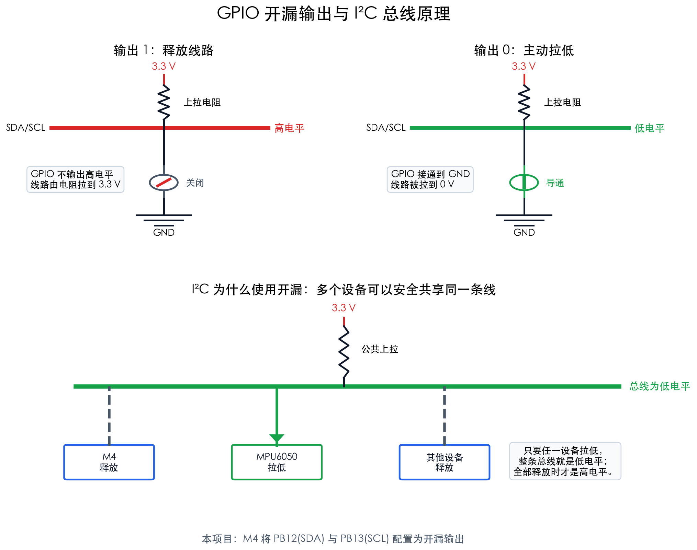

# STM32MP157 接收线圈姿态监测系统

## 项目背景

使用 MPU6050 实时记录接收线圈的姿态，为区分姿态变化引起的测量变化与系统自身的基线漂移提供辅助信息。

现有硬件与开发环境：

- 正点原子 STM32MP157 开发板；
- 正点原子 MPU6050 传感器模块；
- macOS + VS Code。

## SSH 协议配置

开发板与 Mac 通过网线直连，USB-TTL 仅用于查看启动日志和在网络故障时进入串口终端。当前采用以下连接结构：

```text
Mac（VS Code / Terminal）
       │ SSH，TCP 端口 22
       │ 网线直连
       ▼
STM32MP157（OpenSTLinux / Dropbear）
```

### 网络地址

Mac 的 `AX88772D`（`en7`）现使用手动 IPv4 `169.254.50.1/16`，路由器和 DNS 留空；开发板的 `eth0` 固定为 `169.254.50.2/16`。固定 IP 避免直连无 DHCP 服务时等待自动地址分配；链路恢复后 macOS 仍可能短暂等待才把地址挂回接口。

```sh
sudo networksetup -setmanual AX88772D 169.254.50.1 255.255.0.0 ""
```

该网卡若以后用于普通路由器 DHCP 网络，可执行 `sudo networksetup -setdhcp AX88772D` 恢复自动配置。Wi-Fi 配置不受影响。

开发板配置文件为 `/etc/systemd/network/20-eth0.network`：

```ini
[Match]
Name=eth0

[Network]
Address=169.254.50.2/16
DHCP=yes
LinkLocalAddressing=ipv6
```

保留 `DHCP=yes` 后，开发板连接到带 DHCP 的路由器时还可以获得路由器分配的地址；网线与 Mac 直连时，始终可以使用 `169.254.50.2`。

### SSH 服务

开发板使用轻量级 Dropbear SSH。主机密钥位于：

```text
/etc/dropbear/dropbear_rsa_host_key
```

`dropbear.socket` 已设置为开机启用，监听 TCP 22 端口。Mac 的 Ed25519 公钥已写入开发板：

```text
/home/root/.ssh/authorized_keys
```

对应权限为：

```text
/home/root/.ssh                  700
/home/root/.ssh/authorized_keys  600
```

### Mac SSH 配置

Mac 的 `~/.ssh/config` 中已添加：

```sshconfig
Host mp157
    HostName 169.254.50.2
    BindInterface en7
    User root
    IdentityFile ~/.ssh/id_ed25519
    IdentitiesOnly yes
    HostKeyAlgorithms +ssh-rsa
    ConnectTimeout 3
    ServerAliveInterval 2
    ServerAliveCountMax 3
```

开发板上的 Dropbear 版本较旧，只提供 `ssh-rsa` 主机密钥，因此需要 `HostKeyAlgorithms +ssh-rsa`。该兼容设置只对 `mp157` 生效，不会降低其他 SSH 主机的安全策略。

`BindInterface en7` 将此别名的 SSH/SCP 连接绑定到当前有线网卡，避免 `169.254.50.2` 被 macOS 路由到 Wi-Fi。更换网卡或改用 USB 虚拟网络后，需要相应更新接口和目标地址。

Mac 可直接免密登录：

```bash
ssh mp157
```

上传文件：

```bash
scp ./program mp157:/home/root/
```

执行开发板命令：

```bash
ssh mp157 '/bin/uname -a'
```

通过 SSH 执行系统命令时，Dropbear 提供的非交互式 `PATH` 可能不包含 `/sbin`，因此 `ip`、`reboot` 等命令应使用完整路径，例如：

```bash
ssh mp157 '/sbin/ip -br addr'
ssh mp157 '/bin/sync; /sbin/reboot'
```

### 实际验证结果

配置完成后执行了整板重启，并从 Mac 重新建立免密 SSH 连接。开发板返回：

```text
REBOOT_SSH_OK
ATK-MP157
eth0  UP  169.254.50.2/16
active
active
```

这验证了以下项目：

- 开发板重启后静态地址 `169.254.50.2` 自动恢复；
- `systemd-networkd` 处于运行状态；
- `dropbear.socket` 自动启动并监听 SSH 连接；
- Mac 的 `mp157` 主机别名有效；
- Ed25519 公钥免密登录有效；
- 登录目标主机名为 `ATK-MP157`。

### VS Code 连接

在 VS Code 中安装 `Remote - SSH` 扩展，执行 `Remote-SSH: Connect to Host...`，选择 `mp157`，然后打开开发板目录 `/home/root`。如果旧版 OpenSTLinux 无法运行新版 VS Code Server，则保留 Mac 本地编辑方式，使用 `scp` 上传文件并通过 `ssh mp157` 编译、运行和调试。

## mac-linux 交叉编译链

## 异构多核任务划分

STM32MP157 包含双 Cortex-A7 和一个 Cortex-M4。双 Cortex-A7 运行 Linux，由 Linux SMP 调度器管理，不建议在项目初期手工将两个 A7 核分别绑定到不同业务。异构划分的重点是区分 Linux/A7 与实时/M4 的职责：

```text
MPU6050
   │ I²C + 数据就绪中断
   ▼
Cortex-M4（裸机或 FreeRTOS）
   ├── 定周期采样与采样时间戳
   ├── 零偏、温漂补偿和数字滤波
   ├── 姿态解算与运动状态检测
   ├── 环形缓冲和传感器故障恢复
   └── 数据打包
          │ OpenAMP / RPMsg
          ▼
Cortex-A7 × 2（Linux）
   ├── 接收线圈测量数据采集
   ├── 线圈测量与姿态数据时间对齐
   ├── 基线漂移分析与补偿建模
   ├── 文件或数据库存储
   ├── 实时曲线、姿态显示
   └── 网络通信、参数配置和系统管理
```

### Cortex-M4：实时层

M4 负责必须按固定周期执行、不能被 Linux 调度延迟影响的任务：

1. 独占一路 I²C，并通过该总线访问 MPU6050；
2. 响应 MPU6050 的数据就绪中断；
3. 以 200～500 Hz 的频率读取三轴加速度、三轴角速度和温度；
4. 在采样发生时记录单调递增序号和微秒级时间戳；
5. 完成陀螺仪零偏校准、温漂补偿和低通滤波；
6. 使用互补滤波或 Mahony 算法计算姿态四元数；
7. 根据姿态四元数计算接收线圈法向量；
8. 判断静止、运动、冲击、传感器掉线和数据溢出状态；
9. 将多个样本批量发送给 Linux，减少核间通信开销。

M4 应保留原始传感器数据，不能只输出欧拉角。这样可在 Linux 或 Mac 上重新标定、验证或更换姿态算法。

### Cortex-A7/Linux：应用与分析层

Linux 负责允许一定调度延迟、依赖操作系统服务或计算量较大的任务：

1. 使用 `remoteproc` 加载、启动和停止 M4 固件；
2. 通过 RPMsg 接收 M4 的 IMU 数据；
3. 采集接收线圈的测量数据；
4. 根据采样时间戳对齐线圈数据与姿态数据；
5. 分析线圈姿态、温度和测量基线之间的相关性；
6. 将数据保存为 CSV、HDF5 或数据库；
7. 提供实时曲线、三维姿态显示和实验状态界面；
8. 负责 SSH、以太网、文件传输、日志和参数配置。

Linux 可先让调度器自动使用两个 A7 核。只有在实际测试发现数据处理或界面互相干扰时，再使用 CPU affinity 将关键进程绑定到指定 A7 核。

## 核间数据协议

建议共享协议至少包含：

```c
typedef struct {
    uint32_t sequence;
    uint64_t timestamp_us;
    int16_t accel_raw[3];
    int16_t gyro_raw[3];
    int16_t temperature_raw;
    float quaternion[4];
    float coil_normal[3];
    uint32_t status;
} imu_sample_t;
```

推荐 M4 以 500 Hz 采样，每 5 个样本组成一个 RPMsg 数据包，使 Linux 以约 100 Hz 的频率接收数据。若未来需要闭环控制，应直接在 M4 上完成控制，只向 Linux 发送状态和结果。

## 基线漂移分析

Linux 侧可以使用以下观测模型：

$$
y(t)=b(t)+f\!\left(\mathbf n(t),T(t)\right)+\epsilon(t)
$$

其中：

- \(y(t)\)：接收线圈测量值；
- \(b(t)\)：待估计的慢变基线；
- \(\mathbf n(t)\)：接收线圈法向量；
- \(T(t)\)：传感器或系统温度；
- \(f(\cdot)\)：姿态和温度对测量值的影响；
- \(\epsilon(t)\)：随机噪声。

第一阶段先根据 IMU 数据标记线圈的静止区间和运动区间，在静止区间估计慢变基线；随后再通过实验数据拟合姿态、温度和测量值之间的关系。

## MPU6050 的姿态限制

MPU6050 只有加速度计和陀螺仪，没有磁力计：

- 横滚角和俯仰角可利用重力方向长期校正；
- 航向角没有绝对参考，会随陀螺仪零偏逐渐漂移；
- 如果线圈绕重力方向旋转会影响测量，仅靠 MPU6050 无法长期获得完整的绝对三维姿态。

可采用定期回到已知方向、增加外部光学参考或使用额外方向传感器解决航向漂移。若实验环境存在强磁场或时变磁场，不宜直接依赖磁力计。

## 外设所有权

分配给 M4 的 I²C、GPIO、中断、定时器和 DMA 必须在 Linux 设备树中释放或声明为 M4 资源，避免 Linux 与 M4 同时访问同一外设。

| 资源 | 归属 | 用途 |
|---|---|---|
| 一路 I²C | M4 独占 | MPU6050 通信 |
| MPU6050 INT GPIO | M4 | 数据就绪中断 |
| 一个硬件定时器 | M4 | 采样节拍和时间戳 |
| DMA（可选） | M4 | I²C 数据搬运 |
| 一路调试串口 | M4 | 开发初期日志 |
| IPCC/OpenAMP | A7 与 M4 | 核间通信 |
| SD/eMMC | Linux | 实验数据存储 |
| Ethernet/USB/显示接口 | Linux | 网络、外设和界面 |

具体使用哪一路 I²C 和哪些引脚，应根据开发板原理图确认，优先选择扩展接口上未被板载器件占用的控制器。

## 以太网与 SSH 的关系

以太网（Ethernet）是一种有线网络连接方式，负责让 Mac 和 STM32MP157 开发板能够通过网线交换数据。SSH（Secure Shell）则是运行在网络之上的远程登录协议，用于安全地登录开发板并执行命令。

二者不是同一个概念，关系可以表示为：

```text
VS Code / Terminal
       │ SSH、SCP、SFTP
       │ TCP 端口 22
       ▼
       IP 网络
       ▼
以太网（网线和网卡）
       ▼
STM32MP157 上的 Linux
```

简单地说：

- 以太网解决“Mac 和开发板如何联网”；
- IP 地址解决“开发板在网络中的地址是什么”；
- SSH 解决“联网后如何远程登录和控制开发板”；
- SCP/SFTP 通过 SSH 连接传输程序、配置文件和实验数据；
- VS Code Remote SSH 通过 SSH 打开开发板目录、运行程序和远程调试。

SSH 并不只能通过以太网工作，也可以通过 Wi-Fi 或配置成网络接口的 USB 连接工作。对于当前项目，以太网通常延迟更稳定、配置更直接，适合作为 Mac 与开发板之间的主要开发通道。

### 典型开发连接

可以将 Mac 和开发板连接到同一台路由器或交换机，由 DHCP 自动分配 IP 地址：

```text
Mac ──以太网/Wi-Fi── 路由器 ──以太网── STM32MP157
```

也可以用网线直接连接 Mac 与开发板，并为二者配置同一网段的静态 IP：

```text
Mac：       192.168.10.1/24
STM32MP157：192.168.10.2/24
```

完成网络配置后，可在 Mac 终端依次测试：

```bash
ping 192.168.10.2
ssh root@192.168.10.2
scp ./program root@192.168.10.2:/usr/local/bin/
```

其中 `ping` 验证 IP 网络是否连通，`ssh` 登录开发板，`scp` 上传文件。实际用户名和 IP 地址应以开发板的 Linux 镜像配置为准。

需要注意：SSH 是 Mac 与 Cortex-A7/Linux 之间的通信方式；A7/Linux 与 Cortex-M4 之间仍通过 OpenAMP/RPMsg 通信。以太网和 SSH 不直接用于 A7 与 M4 的核间通信。

## Mac + VS Code 开发方式

```text
Mac + VS Code
├── 编辑 M4 固件和 Linux 程序
├── arm-none-eabi-gcc 编译 M4 固件
├── Linux 交叉工具链编译 A7 程序
├── SSH/SCP/rsync 上传文件
└── VS Code Remote SSH 调试 Linux 程序

STM32MP157
├── OpenSTLinux
├── remoteproc 管理 M4 固件
├── RPMsg 与 M4 交换数据
└── gdbserver 调试 Linux 应用
```

M4 开发初期可以使用 ST-LINK 下载和调试；系统联调及正式运行阶段，应由 Linux 的 `remoteproc` 加载 M4 固件。

建议按照以下八个步骤依次实施。

## 步骤一：在 Linux 下验证 MPU6050

### MPU6050 与开发板接线

正点原子 STM32MP157 开发板和 Mini 开发板均提供一个标为 `JP12` 的 1×6 ATK 通用模块接口，官方明确将正点原子 MPU6050 列为该接口支持的模块。因此，对于正点原子原装 MPU6050 模块，推荐直接使用 `JP12`，不需要逐根连接杜邦线。

接线步骤如下：

1. 关闭开发板电源，并拔掉所有可能给开发板供电的 USB 线；
2. 在底板上找到丝印为 `JP12` 或 `ATK MODULE` 的 1×6 插座，以及用于选择 RS232/ATK 的 `JP5`；
3. 对照开发板和 MPU6050 模块上的 `VCC`、`GND` 丝印确认方向；
4. 将 MPU6050 模块垂直、完整地插入 `JP12`；
5. 按底板丝印把 `JP5` 的两只跳线帽切换到 `ATK`/`GBC` 一侧，不能保持在 `RS232` 一侧；
6. 再次确认模块没有反插或错开一位，然后给开发板上电。

> 严禁带电插拔或仅根据模块正反面猜测方向。不同批次模块的元件布局可能不同，必须以 PCB 上的 `VCC` 和 `GND` 丝印为准。反插可能直接损坏 MPU6050 模块或开发板 GPIO。

如果不使用 `JP12`，而是通过杜邦线连接标准 MPU6050 模块，至少需要以下四根线：

| MPU6050 引脚 | STM32MP157 侧 | 是否必需 | 说明 |
|---|---|---:|---|
| `VCC` | `3.3V` | 是 | 初次接线统一使用 3.3 V，避免模块版本差异带来的风险 |
| `GND` | `GND` | 是 | 两块板必须共地 |
| `SCL` | 所选 I²C 控制器的 `SCL` | 是 | I²C 时钟线 |
| `SDA` | 同一路 I²C 控制器的 `SDA` | 是 | I²C 数据线 |
| `INT` | 一个可用 GPIO 输入 | 否 | 第一阶段轮询验证时可以不接；M4 实时采样阶段再接 |
| `AD0` | `GND` 或保持模块默认 | 否 | 低电平时 7 位地址通常为 `0x68`；接 3.3 V 时为 `0x69` |
| `XDA`、`XCL` | 不连接 | 否 | 用于 MPU6050 外接辅助 I²C 传感器，不是主机通信接口 |

使用杜邦线时，`SCL` 和 `SDA` 必须来自同一个硬件 I²C 控制器；不能随意选择两个普通 GPIO，也不能将 `SDA`、`SCL` 接到 `XDA`、`XCL`。具体板端排针编号应以手中开发板版本的原理图和丝印为准。

正点原子模块通常已经在 `SCL`、`SDA` 上设置上拉电阻，因此直接插入 `JP12` 时不要重复添加强上拉。若使用其他厂商的裸模块，应断电后用万用表或查看原理图确认是否已有上拉电阻。

确认 MPU6050 的供电、接线、I²C 地址和传感器工作状态正常。

### 在 Linux 下确认 I²C 通信

这一步的目的不是完成最终姿态采集，而是在开发 M4 固件之前，先用 Linux 排除供电、接线、I²C 总线选择和器件地址错误。只有 Linux 能稳定读到 MPU6050，后续把同一外设转交给 M4 才有明确的硬件基线；否则很难判断故障来自接线、设备树还是 M4 程序。

当前开发板系统已经提供四个 I²C 字符设备：

```text
/dev/i2c-0
/dev/i2c-1
/dev/i2c-2
/dev/i2c-3
```

但当前出厂镜像没有安装 `i2cdetect`、`i2cget`、Python `smbus` 或 `smbus2`。因此本步骤需要先准备一个与当前 ARMv7 Hard-Float 系统兼容的 `i2c-tools`，或者在交叉编译环境建立后编译一个最小 I²C 测试程序。

首先根据开发板原理图、设备树和 `JP12` 的连接关系确定目标总线编号 `<N>`。不要在不清楚总线上已有器件的情况下扫描全部 I²C 控制器，因为部分寄存器访问可能影响同总线上的板载设备。

具备 `i2c-tools` 后执行：

```bash
i2cdetect -y <N>
```

MPU6050 的 `AD0` 为低电平时应看到地址 `0x68`，为高电平时应看到 `0x69`。然后读取 `WHO_AM_I` 寄存器 `0x75`：

```bash
i2cget -y <N> 0x68 0x75
```

默认连接下预期返回：

```text
0x68
```

本步骤的完成判据为：

- 目标 I²C 设备节点存在；
- 能检测到地址 `0x68` 或 `0x69`；
- 连续读取 `WHO_AM_I` 均得到正确值；
- 断电重启后仍能重复检测成功；
- 内核日志中没有 I²C 超时、总线忙或仲裁失败错误。

上述验证完成后，应记录所用 I²C 控制器、Linux 设备节点、SCL/SDA 引脚、器件地址和测试结果，供步骤三把该外设从 Linux 转交给 M4 时使用。

### 本次实际执行结果

已在 Mac 上创建两个无需第三方 Python 包的检测程序，并通过 SSH 上传到开发板：

```text
Mac：tools/i2c_mpu6050_probe.py
开发板：/home/root/i2c_mpu6050_probe.py

Mac：tools/gpio_mpu6050_probe.py
开发板：/home/root/gpio_mpu6050_probe.py
```

首先检查四个现有硬件 I²C 设备节点的 `0x68` 和 `0x69`，均未收到应答：

> `0x68` 和 `0x69` 是 MPU6050 可选的两个 7 位 I²C 从机地址，用于让主控在同一条 I²C 总线上识别目标设备。模块的 `AD0` 引脚为低电平或接地时使用 `0x68`，为高电平或接 3.3 V 时使用 `0x69`。本项目实测地址为 `0x68`，读取 `WHO_AM_I` 寄存器也返回 `0x68`，说明主控已找到并正确识别 MPU6050；对 `0x69` 没有应答是正常现象。设置两个可选地址还允许同一条总线上连接两块 MPU6050，分别使用 `0x68` 和 `0x69`，避免地址冲突。

```text
Available I2C devices: /dev/i2c-0 /dev/i2c-1 /dev/i2c-2 /dev/i2c-3
RESULT: MPU6050 not detected
```

进一步检查运行中的引脚复用后确认：`JP12` 的两根模块通信线连接到 UART5 的 `PB12/PB13`，当前由 `40011000.serial` 使用，对应 `/dev/ttySTM2`，并不属于上述四个硬件 I²C 节点。调试串口是 `/dev/ttySTM0`，因此可以临时解除 UART5 而不影响 SSH 或调试串口。

随后临时解除 UART5，将 `PB12/PB13` 切换为 GPIO，以开漏方式执行软件 I²C 检测，并在程序结束时自动恢复 UART5。实测结果为：

```text
Probing SDA=PB12,SCL=PB13; idle SDA=1, SCL=0
SKIP: bus is stuck low or has no effective pull-up
Probing SDA=PB13,SCL=PB12; idle SDA=0, SCL=1
SKIP: bus is stuck low or has no effective pull-up
RESULT: MPU6050 not detected on JP12
```

结果说明 `PB13` 在释放后仍保持低电平，I²C 总线没有处于 SDA、SCL 均为高电平的空闲状态。正点原子资料表明 UART5 同时连接 RS232 母头和 ATK 模块接口，需要由 `JP5` 跳线帽选择去向。因此当前最可能的原因依次为：

1. `JP5` 仍连接到 RS232 一侧，RS232 电路干扰 ATK 模块通信线；
2. MPU6050 模块未插紧、反插或错开一位；
3. 模块没有正确供电；
4. 模块或连接线存在硬件故障。

断电调整模块连接与 `JP5` 后再次执行探测，得到：

```text
Probing SDA=PB12,SCL=PB13; idle SDA=1, SCL=1
REPLY address=0x68 WHO_AM_I=0x68
MISS address=0x69: no ACK after write address
Probing SDA=PB13,SCL=PB12; idle SDA=1, SCL=1
MISS address=0x68: no ACK after write address
MISS address=0x69: no ACK after write address
RESULT: MPU6050 detected (SDA=PB12,SCL=PB13), address=0x68, WHO_AM_I=0x68
```

最终确认结果：

- MPU6050 已正确连接并供电；
- `JP12` 上的信号映射为 `SDA=PB12`、`SCL=PB13`；
- 两根总线在空闲状态下均为高电平，上拉工作正常；
- MPU6050 使用默认 7 位地址 `0x68`；
- `WHO_AM_I` 寄存器返回 `0x68`，器件身份验证通过；
- 探测脚本退出码为 `0`；
- 探测完成后 `40011000.serial` 已重新绑定到 `stm32-usart`，UART5 恢复正常。

因此，步骤一的硬件连接与基础通信验证已完成。需要注意，当前验证使用 GPIO 软件 I²C；步骤三应决定继续使用该引脚组合，还是把 MPU6050 改接到可由 M4 使用的硬件 I²C 控制器。

## 步骤二：创建最小 M4 工程

完成 Cortex-M4 的 LED、串口和定时器验证，确认固件能够正常编译、下载和运行。

### 方案

本步骤只验证 Cortex-M4 的基础开发链路，不在这一阶段接入 MPU6050 或实现 OpenAMP。目标是证明以下链路可用：

```text
Mac + VS Code
   │ 编辑与编译
   ▼
arm-none-eabi-gcc 生成 M4 ELF 固件
   │ SCP
   ▼
STM32MP157 Linux
   │ remoteproc 加载
   ▼
Cortex-M4 运行 LED/定时器最小程序
```

#### 1. 选择 C 语言和工具链

M4 固件使用 C 语言，因为 STM32Cube HAL、CMSIS、FreeRTOS 和 OpenAMP 的官方接口均以 C 为主。Mac 侧使用以下工具：

- `arm-none-eabi-gcc`：编译 Cortex-M4 裸机或 FreeRTOS 固件；
- CMake 或 Make：组织构建；
- VS Code C/C++ 扩展：代码补全和静态检查；
- SSH/SCP：把 ELF 固件传给开发板；
- ST-LINK 与 OpenOCD：仅在需要断点调试时使用，不是首次运行的必需条件。

编译目标参数为：

```text
-mcpu=cortex-m4
-mthumb
-mfpu=fpv4-sp-d16
-mfloat-abi=hard
```

这里不能使用 A7/Linux 的 `arm-ostl-linux-gnueabi-gcc`，因为 M4 运行的是裸机或实时固件，而不是 Linux 用户程序。

#### 2. 从匹配的官方工程模板开始

不手写启动文件和链接脚本。应从与当前 STM32MP157D、正点原子底板和 STM32CubeMP1 版本匹配的 M4 示例复制一个最小工程，保留以下文件：

```text
startup_stm32mp157*.s
system_stm32mp1xx.c
STM32MP157*.ld
CMSIS/
STM32MP1xx_HAL_Driver/
Core/Inc/
Core/Src/
```

链接脚本决定 M4 固件运行的 RAM 区域，必须与 Linux 设备树中的 M4 保留内存一致。使用不匹配的链接地址可能覆盖 Linux 内存，因此不能直接套用普通 STM32F4 工程。

#### 3. 创建最小工程结构

建议目录为：

```text
m4/
├── CMakeLists.txt
├── cmake/
│   └── arm-none-eabi-toolchain.cmake
├── Core/
│   ├── Inc/
│   │   └── main.h
│   └── Src/
│       ├── main.c
│       ├── stm32mp1xx_hal_msp.c
│       └── stm32mp1xx_it.c
├── Drivers/
├── startup/
├── linker/
└── build/
```

构建产物至少包括：

```text
m4_minimal.elf
m4_minimal.bin
m4_minimal.map
```

Linux `remoteproc` 优先加载带有段信息的 `.elf`，`.bin` 主要用于调试和尺寸检查，`.map` 用于核对代码、数据、堆栈和内存地址。

#### 4. 最小固件功能

第一版固件只实现：

1. `HAL_Init()` 和系统时钟基础初始化；
2. 初始化一个允许分配给 M4 的 LED GPIO；
3. 初始化一个 M4 可用的硬件定时器或 SysTick；
4. 每 500 ms 翻转一次 LED；
5. 在主循环中执行低功耗等待或空循环；
6. 保留错误处理函数，使初始化失败时以固定频率快速闪灯。

UART 日志属于可选项。当前 `UART4/ttySTM0` 是 Linux 调试控制台，`UART5/PB12/PB13` 又连接 `JP12` 上的 MPU6050，因此在异构运行模式下不能把这两路 UART 直接交给 M4。首次验证优先使用 LED；需要日志时，选择另一条未被 Linux 占用的 UART，或者在步骤五通过 RPMsg 输出日志。

#### 5. 编译与静态检查

在 Mac 的构建目录执行：

```bash
cmake -S m4 -B m4/build -G Ninja \
  -DCMAKE_TOOLCHAIN_FILE=m4/cmake/arm-none-eabi-toolchain.cmake
cmake --build m4/build
arm-none-eabi-size m4/build/m4_minimal.elf
arm-none-eabi-objdump -h m4/build/m4_minimal.elf
```

检查项目包括：

- ELF 架构为 ARM Cortex-M4/Thumb；
- 浮点 ABI 与 STM32MP157 M4 配置一致；
- 入口地址和各段地址位于 M4 保留内存；
- 没有链接到 macOS 或 Linux 的系统库；
- `.map` 中不存在超出链接脚本范围的段。

#### 6. 通过 Linux remoteproc 启动

将固件上传到开发板：

```bash
scp m4/build/m4_minimal.elf mp157:/lib/firmware/
```

在开发板上先确认 remoteproc 实例：

```bash
ssh mp157 'ls -l /sys/class/remoteproc/'
```

确定 M4 对应的 `remoteprocN` 后，再设置固件并启动：

```bash
ssh mp157 '
  echo stop > /sys/class/remoteproc/remoteprocN/state 2>/dev/null || true
  echo m4_minimal.elf > /sys/class/remoteproc/remoteprocN/firmware
  echo start > /sys/class/remoteproc/remoteprocN/state
  cat /sys/class/remoteproc/remoteprocN/state
'
```

不能直接猜测 `remoteprocN` 的编号；必须根据 `/sys/class/remoteproc/remoteproc*/name` 确认哪个实例对应 Cortex-M4。

#### 7. 资源归属与验证标准

Linux 设备树必须释放 M4 使用的 LED GPIO 和定时器，否则两个内核可能同时访问同一资源。第一版最小工程应避免触碰以下资源：

- Linux 调试串口 `UART4/ttySTM0`；
- MPU6050 当前使用的 `UART5/PB12/PB13`；
- eMMC、TF 卡和以太网；
- Linux 正在使用的显示、USB 和板载传感器。

本步骤完成的判据为：

- Mac 能重复编译得到相同的 ELF；
- ELF 的入口和内存段检查正确；
- 固件能通过 SCP 上传；
- Linux remoteproc 能启动和停止 M4；
- LED 按 500 ms 周期稳定翻转；
- 连续启动、停止 10 次均无 Linux 崩溃或资源冲突；
- Linux 重启后仍能正常使用 SSH、eMMC 和以太网。

### 实际执行结果

执行日期：2026-09-18。

#### 1. Mac 端工具链

已通过 Homebrew 安装 Cortex-M4 交叉编译器和 Ninja：

```bash
brew install arm-none-eabi-gcc ninja
```

> `arm-none-eabi-gcc` 是运行在 Mac 上、为 ARM 裸机系统生成机器代码的交叉编译器。其中：`arm` 表示目标处理器属于 ARM 架构，`none` 表示没有指定厂商，`eabi` 表示使用嵌入式应用二进制接口，`gcc` 表示 GNU C/C++ 编译器。它把 M4 的 C/C++ 源代码编译并链接成 Cortex-M4 能运行的 `.elf` 固件。它不是用来编译 STM32MP157 的 Linux/A7 程序的。
>
> `Ninja` 是一个轻量、快速的构建执行器。它本身不理解 C 语言，也不负责把源码变成机器代码；它按照 CMake 生成的构建规则，自动调用 `arm-none-eabi-gcc`，并只重新编译发生变化的文件。
> > “构建执行器”是按照一份构建规则，依次或并行运行编译、链接等命令的工具。它会判断哪些源文件发生了变化、这些文件依赖哪些头文件、应该调用什么编译器，以及哪些步骤需要重新执行。
> >
> > 例如，第一次构建时，Ninja 会调用 `arm-none-eabi-gcc` 编译全部 `.c` 文件，再把生成的 `.o` 文件链接为 `.elf`。如果之后只修改了 `main.c`，Ninja 通常只重新编译 `main.c` 并重新链接，而不会重复编译所有未变化的文件。
> >
> > Ninja 负责“决定执行哪些命令并安排执行顺序”，`arm-none-eabi-gcc` 负责“真正编译和链接代码”。构建规则通常由 CMake 根据项目中的 `CMakeLists.txt` 自动生成，而不是由 Ninja 自己设计。
>
> 两者的关系可以理解为：CMake 生成“施工计划”，Ninja 按计划调度编译，`arm-none-eabi-gcc` 真正完成编译和链接，最终得到供 M4 加载的 ELF 固件：
>
> ```text
> C/C++ 源代码 → CMake 生成规则 → Ninja 执行规则
>                                  ↓
>                         arm-none-eabi-gcc
>                                  ↓
>                            M4 固件 .elf
> ```

版本检查结果：

```text
arm-none-eabi-gcc (GCC) 16.2.0
GNU Binutils 2.47.20260726
Ninja 1.13.2
CMake 4.2.1
```

因此，Mac 已具备使用 VS Code、CMake、Ninja 和 `arm-none-eabi-gcc` 编译 Cortex-M4 固件的基础环境。

#### 2. 开发板 M4 状态

通过已有 SSH 别名 `mp157` 检查开发板：

```bash
ssh mp157 '
for p in /sys/class/remoteproc/remoteproc*; do
  echo "$p"
  cat "$p/name"
  cat "$p/state"
done
'
```
> 这段命令从 Mac 登录开发板，并检查 Linux 当前管理的所有远程处理器：
>
> - `ssh mp157 '...'`：通过 SSH 连接名称为 `mp157` 的主机，并在开发板上执行单引号内的整段 Shell 脚本；这些命令不是在 Mac 本地执行的。
> - `for p in /sys/class/remoteproc/remoteproc*`：查找 `/sys/class/remoteproc/` 下名称符合 `remoteproc*` 的目录，并依次把每个目录路径保存到变量 `p`。每个目录代表一个由 Linux `remoteproc` 框架管理的远程处理器。
> - `do ... done`：Shell 循环的开始与结束。目录有几个，中间的命令就执行几次。
> - `echo "$p"`：输出当前远程处理器的目录，例如 `/sys/class/remoteproc/remoteproc0`。
> - `cat "$p/name"`：读取该实例的名称；输出 `m4` 表示它对应 STM32MP157 内部的 Cortex-M4。
> - `cat "$p/state"`：读取运行状态。`offline` 表示 M4 尚未启动，`running` 表示 M4 固件正在运行。
>
> 变量 `$p` 外面的双引号用于把目录路径当成一个完整参数处理。最外层单引号则阻止 Mac 提前展开 `$p` 和通配符，确保它们由开发板上的 Shell 解释。

实测结果为：

```text
/sys/class/remoteproc/remoteproc0
m4
offline
```

由此确认 `remoteproc0` 对应 STM32MP157 内部的 Cortex-M4，测试前 M4 处于停止状态。

#### 3. 使用板载示例固件启动 M4

开发板的 `/lib/firmware/` 中已有厂家提供的 `RPMsg_UART_CM4.elf`。本次先使用该固件验证 Linux 加载 M4 和 RPMsg 的完整链路：

```bash
ssh mp157 '
r=/sys/class/remoteproc/remoteproc0
echo RPMsg_UART_CM4.elf > "$r/firmware"
echo start > "$r/state"
cat "$r/state"
ls /sys/bus/rpmsg/devices
ls /dev/ttyRPMSG*
'
```

启动后的实测结果：

```text
state: running
RPMsg device: virtio0.rpmsg-tty-channel.-1.0
RPMsg character device: /dev/ttyRPMSG0
```

内核日志中的关键内容为：

```text
remoteproc remoteproc0: Booting fw image RPMsg_UART_CM4.elf
virtio_rpmsg_bus virtio0: creating channel rpmsg-tty-channel
rpmsg_tty ... new channel ... ttyRPMSG0
remoteproc remoteproc0: remote processor m4 is now up
```

这证明以下链路已经实际跑通：

```text
Linux remoteproc → 加载 ELF → Cortex-M4 启动 → RPMsg 通道建立
```

#### 4. 固件格式检查

将板载示例 ELF 复制到 Mac 后，使用新安装的工具检查：

```bash
scp mp157:/lib/firmware/RPMsg_UART_CM4.elf /tmp/mp157_RPMsg_UART_CM4.elf
arm-none-eabi-objdump -f /tmp/mp157_RPMsg_UART_CM4.elf
arm-none-eabi-size /tmp/mp157_RPMsg_UART_CM4.elf
```

检查结果：

```text
格式：elf32-littlearm
架构：armv7e-m
入口地址：0x1000a315
text：43572 bytes
data：288 bytes
bss：3092 bytes
```

该 ELF 的架构与 STM32MP157 Cortex-M4 相符。

#### 5. 测试后的恢复状态

验证完成后执行：

```bash
ssh mp157 'echo stop > /sys/class/remoteproc/remoteproc0/state'
```

最终检查结果为：

```text
state: offline
firmware: RPMsg_UART_CM4.elf
```

M4 已停止，开发板恢复到测试前的 `offline` 状态；固件选择字段仍保留厂家示例文件名，这是正常现象。

#### 6. 当前结论与剩余工作

已完成：

- Mac 交叉编译工具链安装；
- SSH 访问和 `/lib/firmware/` 可用性检查；
- M4 `remoteproc` 实例识别；
- 厂家 M4 ELF 的架构检查；
- M4 启动、RPMsg 设备创建和停止测试。

本小节执行时尚未导入板级工程，因此先使用厂家 RPMsg 固件验证加载链路。随后已在下方“hello.c 验证”中导入 ST 官方 STM32CubeMP1 基础文件、建立自定义 `m4/` 工程，并完成板载 LED 闪烁实机验证。精确定时器和物理 UART 验证暂未实施；后续日志优先使用 RPMsg，避免占用 Linux 控制台或 MPU6050 接口。

### hello.c验证

本次使用板载 `user-led` 做单灯流水（周期闪烁）验证。开发板运行中的设备树表明：

```text
user-led → GPIOF pin 3（PF3）
有效电平 → 低电平点亮，高电平熄灭
```

固件以 ST 官方 [STM32CubeMP1](https://github.com/STMicroelectronics/STM32CubeMP1) 的 STM32MP157C-DK2 GPIO 示例、CMSIS 头文件及内存布局为依据，并根据本板设备树把输出脚改为 PF3。工程位于：

```text
m4/
├── CMakeLists.txt
├── cmake/arm-none-eabi-toolchain.cmake
├── linker/stm32mp157_m4.ld
└── src/
    ├── hello.c
    └── startup.c
```

`hello.c` 完成以下操作：

1. 打开 Cortex-M4 侧的 GPIOF 时钟；
2. 将 PF3 配置为推挽输出；
3. 通过 GPIO `BSRR` 寄存器交替输出低、高电平；
4. 在两次切换之间使用可见延时，使板载 `user-led` 周期闪烁；
5. 提供空的 `.resource_table`，使 Linux `remoteproc` 能识别并加载固件。

#### 编译

由于 Homebrew 的 `arm-none-eabi-gcc 16.2.0` 包不包含完整的 Newlib 标准头文件，本项目使用免管理员安装的 Arm GNU Toolchain 15.3.1。工具链从 Arm 官方安装包解压到项目的 `third_party/arm-toolchain-extracted-15.3/`，CMake 工具链文件已指向该编译器。

执行：

```bash
cmake -S m4 -B m4/build-arm -G Ninja \
  -DCMAKE_TOOLCHAIN_FILE=cmake/arm-none-eabi-toolchain.cmake
cmake --build m4/build-arm
```

实测编译成功：

```text
text    data    bss    dec    hex
860     0       0      860    35c
```

ELF 静态检查结果：

```text
架构：ARM EABI5，hard-float
入口地址：0x10000005
向量表：0x00000000，大小 0x298
代码区：0x10000000
resource table：0x10020000
```

这些地址与开发板厂家 M4 固件及 ST 官方 STM32MP157 M4 工程采用的内存分区一致。

#### 上传并启动

先把 Linux 对 `user-led` 的自动触发关闭并将 LED 熄灭，然后上传和启动固件：

```bash
scp m4/build-arm/m4_hello.elf mp157:/lib/firmware/m4_hello.elf

ssh mp157 '
r=/sys/class/remoteproc/remoteproc0
[ "$(cat "$r/state")" = running ] && echo stop > "$r/state"
echo none > /sys/class/leds/user-led/trigger
echo 0 > /sys/class/leds/user-led/brightness
echo m4_hello.elf > "$r/firmware"
echo start > "$r/state"
cat "$r/state"
'
```

实测输出：

```text
running
```

内核日志确认：

```text
remoteproc remoteproc0: Booting fw image m4_hello.elf, size 13492
remoteproc remoteproc0: remote processor m4 is now up
```

#### GPIO 翻转验证

除了肉眼观察 LED，还使用只读脚本 `tools/sample_gpiof_odr.py` 读取 GPIOF 输出数据寄存器，避免只凭 `remoteproc` 状态判断固件是否真正执行：

```bash
scp tools/sample_gpiof_odr.py mp157:/tmp/sample_gpiof_odr.py
ssh mp157 'python3 /tmp/sample_gpiof_odr.py'
```

采样中观察到：

```text
ODR=0x00000004 PF3=0 LED=ON
ODR=0x0000000c PF3=1 LED=OFF
ODR=0x00000004 PF3=0 LED=ON
```

PF3 确实在低、高电平之间循环变化，因此可以确认代码正在 Cortex-M4 上持续执行，而不是仅被 Linux 成功加载。

#### 停止固件

本次验证后如果需要停止流水灯，执行：

```bash
ssh mp157 'echo stop > /sys/class/remoteproc/remoteproc0/state'
```

当前测试结束时固件仍保持 `running`，便于直接观察板载 `user-led`。这是受控验证：Linux 的 LED trigger 已设为 `none`，但 GPIO LED 驱动仍声明占用 PF3。正式项目中必须在设备树中禁用该 Linux LED 节点或把 PF3 明确分配给 M4，避免 A7 与 M4 同时操作同一 GPIO。

## 步骤三：将 MPU6050 外设转移给 M4

将 MPU6050 使用的 I²C 和中断分配给 M4，并修改 Linux 设备树以避免外设访问冲突。

### 方案

#### 1. 当前资源关系

MPU6050 当前通过 JP12 与开发板连接：

```text
MPU6050 SDA → PB12
MPU6050 SCL → PB13
MPU6050 AD0 → 低电平，I²C 地址 0x68
MPU6050 INT → 尚未连接
```

> 这里列出的是 MPU6050 的四个通信与控制信号引脚，不包括供电用的 `VCC` 和 `GND`：
>
> | 引脚 | 全称 | 信号方向 | 作用及当前接法 |
> |---|---|---|---|
> | `SDA` | Serial Data | 双向 | I²C 数据线，用于传输寄存器地址、配置数据和传感器测量值。当前连接 STM32MP157 的 `PB12`，由 M4 配置为开漏 GPIO。空闲时应为高电平。 |
> | `SCL` | Serial Clock | 主要由主机输出 | I²C 时钟线，由 M4 产生时钟脉冲，使 MPU6050 按位收发数据。当前连接 `PB13`，同样使用开漏方式；空闲时应为高电平。 |
> | `AD0` | Address Select | 输入到 MPU6050 | 选择 I²C 从机地址。接低电平时地址为 `0x68`，接高电平时地址为 `0x69`。当前保持低电平，因此实测地址和 `WHO_AM_I` 都是 `0x68`；不能悬空以免地址不稳定。 |
> | `INT` | Interrupt | MPU6050 输出 | 中断通知线。可以在新一帧数据准备好、运动检测或 FIFO 事件发生时通知 M4，从而避免持续轮询。当前没有物理连接，因此现阶段固件采用循环读取；后续应接到一个未被 Linux 占用且支持 M4 EXTI 的 GPIO。 |
>
> `SDA` 和 `SCL` 构成数据总线，`AD0` 只决定设备地址，`INT` 只负责通知事件。即使暂时不接 `INT`，I²C 读取仍能工作；但 `SDA`、`SCL`、`VCC` 和 `GND` 缺一不可。

PB12/PB13 在当前 Linux 设备树中分配给 `UART5`，设备为 `40011000.serial`，Linux 启动后表现为 `/dev/ttySTM2`。当前接线并不是 STM32MP157 的硬件 I²C 引脚组合，因此第一阶段在 M4 上继续使用 GPIO 开漏方式实现软件 I²C：

> GPIO 开漏（Open-Drain）是一种输出方式：GPIO 内部只能主动把信号线拉到低电平，不能主动输出高电平。程序“输出 0”时，内部晶体管导通，将线路接地；程序“输出 1”时，晶体管关闭，引脚进入释放状态，线路依靠外部上拉电阻回到高电平。
>
> 
>
> 图中上半部分分别表示线路被释放和被拉低时的电流路径；下半部分表示多个 I²C 设备共享总线时，只要任意一个设备拉低线路，整条总线就会保持低电平。图片由 `tools/figures/draw_gpio_open_drain.py` 使用 Python 和 Matplotlib 生成，可在修改脚本后重新运行生成。
> ```text
> 输出 0：GPIO 晶体管导通 → 信号线接地 → 低电平
> 输出 1：GPIO 晶体管关闭 → 信号线被释放 → 上拉电阻产生高电平
> ```
>
> I²C 的 SDA 和 SCL 必须使用这种方式。因为主机和从机连接在同一组线上，任何设备都可以安全地把线路拉低；没有设备拉低时，线路才由上拉电阻变为高电平。这样即使两个设备同时操作总线，也不会出现一个设备强推高电平、另一个设备强拉低电平所造成的近似短路。
>
> 在当前项目中，M4 将 PB12（SDA）和 PB13（SCL）配置为开漏输出。MPU6050 模块上的上拉电阻负责产生高电平，M4 通过“拉低”和“释放”两种动作模拟 I²C 时钟及数据。实测 `idle_SDA=1`、`idle_SCL=1`，说明两条线路在释放后都能被正常上拉。

```text
Linux 停止使用 UART5/PB12/PB13
                ↓
Cortex-M4 接管 GPIOB12/GPIOB13
                ↓
M4 软件 I²C 读取 MPU6050
                ↓
M4 SRAM 状态区供 Linux 只读验证
```

#### 2. 分阶段消除资源冲突

本次采用可恢复的运行时迁移：

1. 停止当前 M4 固件；
2. 从 Linux `stm32-usart` 驱动解绑 `40011000.serial`；
3. 将 `m4_mpu6050.elf` 上传到 `/lib/firmware/`；
4. 由 `remoteproc0` 启动 M4；
5. M4 把 PB12/PB13 配成开漏输出并读取 `WHO_AM_I`；
6. Linux 只读检查 M4 SRAM 中的探测结果，不再操作 PB12/PB13。

运行时解绑在开发板重启后会失效。正式部署时，应在正点原子 BSP 的板级 DTS 中禁用 UART5：

```dts
&uart5 {
    status = "disabled";
};
```

修改 DTS 后必须重新编译对应 DTB、备份现有启动 DTB、安装新 DTB 并重启验证。当前系统使用的是厂商定制镜像，但工作区中没有该镜像的准确 DTS 源码和构建配置，因此本次没有直接覆盖 `/boot` 中的 DTB，避免开发板重启后无法启动。运行时解绑已经完成本次测试所需的资源隔离。

#### 3. M4 固件设计

固件源码为 `m4/src/mpu6050.c`，功能包括：

- 使用 PB12 作为 SDA、PB13 作为 SCL；
- 配置 GPIO 为开漏模式，依赖 MPU6050 模块上的 I²C 上拉；
- 依次探测 `0x68` 和 `0x69`；
- 读取寄存器 `0x75`（`WHO_AM_I`）；
- 将结果持续写入 M4 SRAM 的 `0x10020100`；
- 使用递增序号证明 M4 在持续执行，而不是读取到残留数据。

共享状态结构包含：

```text
magic、sequence、address、who_am_i、error、idle_lines
```

其中 `error=0` 表示地址、寄存器和读操作均收到正确 ACK。

#### 4. 中断方案

MPU6050 的 `INT` 引脚应连接到一个暴露在排针上、未被 Linux 使用且允许 M4 访问的 GPIO。然后：

1. 将 MPU6050 的 `INT_ENABLE` 寄存器配置为 Data Ready 中断；
2. 将目标 GPIO 配置为输入；
3. 配置对应 EXTI 上升沿中断；
4. 在中断服务函数中只记录时间戳并触发一次数据读取；
5. Linux 设备树中不得再声明或占用该 GPIO。

[需补充：MPU6050 的 INT 线目前没有物理连接；确定并接好一个空闲 M4 GPIO 后，才能执行 EXTI 中断验证。]

### 执行结果

执行日期：2026-09-18。

#### 1. 编译结果

已在现有 `m4/` CMake 工程中增加 `m4_mpu6050.elf` 目标：

```bash
cmake --build m4/build-arm --target m4_mpu6050.elf
```

编译成功：

```text
text    data    bss    dec    hex
1292    0       24     1316   524
```

ELF 检查结果：

```text
入口地址：0x10000005
resource table：0x10020000
共享状态区：0x10020100，大小 24 bytes
架构：ARM EABI5 hard-float
```

#### 2. 运行时转移资源

实测执行了以下操作：

```bash
scp m4/build-arm/m4_mpu6050.elf mp157:/lib/firmware/

ssh mp157 '
r=/sys/class/remoteproc/remoteproc0
echo stop > "$r/state"
echo 40011000.serial > /sys/bus/platform/drivers/stm32-usart/unbind
echo m4_mpu6050.elf > "$r/firmware"
echo start > "$r/state"
'
```

启动结果：

```text
state=running
firmware=m4_mpu6050.elf
UART5=unbound
```

内核日志确认：

```text
remoteproc remoteproc0: Booting fw image m4_mpu6050.elf, size 13824
remoteproc remoteproc0: remote processor m4 is now up
```

#### 3. MPU6050 实测结果

通过 `tools/read_m4_mpu6050_status.py` 读取 M4 共享状态：

```text
magic=0x4d505536
sequence=1
address=0x68
WHO_AM_I=0x68
error=0
idle_SDA=1
idle_SCL=1
```

再次读取时序号从 `48` 增加到 `54`，同时 `WHO_AM_I` 始终为 `0x68`、`error=0`。由此确认：

- PB12/PB13 已从 Linux UART5 的运行时控制中释放；
- Cortex-M4 正在产生 I²C 时序；
- MPU6050 在地址 `0x68` 正确应答；
- `WHO_AM_I` 读取值正确；
- M4 正在持续执行传感器访问循环。

#### 4. 一键执行与恢复

以后可以在 Mac 运行以下脚本，自动编译、上传、解绑 UART5、启动 M4 并读取验证结果：

```bash
sh tools/start_mpu6050_m4.sh
```

停止 M4 并把 UART5 重新绑定给 Linux：

```bash
sh tools/stop_mpu6050_m4.sh
```

本次执行结束时保持以下状态，便于继续步骤四：

```text
Cortex-M4：running
固件：m4_mpu6050.elf
UART5：unbound
MPU6050：由 M4 通过 PB12/PB13 软件 I²C 持续访问
```

当前已完成 GPIO/I²C 的运行时迁移和实机读取验证。永久设备树迁移需要取得当前正点原子系统所使用的板级 DTS 工程后再实施；MPU6050 数据就绪中断则需要先完成 `INT` 物理接线。

## 步骤四：实现 M4 定周期采样

在 M4 上完成固定周期采样、连续序号和采样时间戳。

### 方案

#### 1. 采样频率与时间基准

开发板运行时的时钟树实测为：

```text
pll3_p = 208877930 Hz
ck_mcu = 208877930 Hz
```

使用 Cortex-M4 内核私有的 SysTick 产生 1 ms 中断，不占用 Linux 管理的外设定时器。SysTick 重装值按下式设置：

```text
reload = round(208877930 / 1000) - 1
```

`SysTick_Handler()` 每毫秒递增一次 `milliseconds`。采样任务维护绝对的下一次执行时刻 `next_sample_ms`，而不是每轮简单延时，因此不会把一次 I²C 读取所消耗的时间逐帧累加到周期中。

当前 GPIO 软件 I²C 完成一次 14 字节读取约需 16.6 ms，因此最终采用：

```text
采样周期：20 ms
采样频率：50 Hz
MPU6050 SMPLRT_DIV：19
DLPF 配置：3
加速度量程：±2 g
陀螺仪量程：±250 °/s
```

#### 2. 每帧采样内容

每个周期从 MPU6050 的 `ACCEL_XOUT_H`（`0x3B`）开始连续读取 14 字节：

```text
Accel X/Y/Z → Temperature → Gyro X/Y/Z
```

连续读取能保证同一帧的六轴数据来自同一个寄存器快照，并减少重复发送设备地址与寄存器地址的开销。

#### 3. 序号和时间戳

共享状态区为每帧保存：

- `sequence`：每轮采样处理结束后递增的 32 位连续序号；是否成功由同一帧的 `last_error` 判断；
- `scheduled_ms`：该帧计划执行的 M4 毫秒时刻；
- `timestamp_ms`：实际开始读取传感器的 M4 毫秒时刻；
- `period_ms`：配置的采样周期，当前为 20；
- `overruns`：任务至少落后一个完整周期的次数；
- `i2c_errors`：累计 I²C 读取失败次数；
- `last_error`：最近一次 I²C 操作错误码；
- 加速度、温度和陀螺仪的 16 位有符号原始值。

传感器数据和时间戳全部写完后，固件执行内存屏障并最后更新 `sequence`，Linux 读取端连续两次看到相同序号时，才把该内容视为一帧一致的数据。

当前时间戳是 M4 固件启动后的相对毫秒时间，32 位计数约 49.7 天回绕一次；后续与线圈数据融合时，需要由 Linux/RPMsg 将它映射到系统单调时钟，不能把它直接当作日期时间。

#### 4. 超期与 I²C 总线恢复

如果实际时刻比计划时刻落后至少一个周期，固件会增加 `overruns`，并从当前时刻重新安排下一帧，避免连续追赶造成任务拥塞。

Linux `remoteproc` 可能在一次软件 I²C 传输中途停止旧固件。新固件启动时会先释放 SDA，再向 SCL 输出 9 个恢复脉冲并产生 STOP，随后重新探测 `0x68/0x69`。这样可以恢复停留在未完成事务中的 MPU6050 状态机。

### 结果

执行日期：2026-09-18。

#### 1. 固件实现与编译

定周期采样已经集成到 `m4/src/mpu6050.c`，SysTick 向量已经加入 `m4/src/startup.c`。重新编译：

```bash
cmake --build m4/build-arm --target m4_mpu6050.elf
```

最终固件尺寸：

```text
text    data    bss    dec    hex
1892    0       80     1972   7b4
```

#### 2. 100 Hz 初始测试

初始目标设置为 10 ms（100 Hz），实测结果为：

```text
mean_period_ms=16.585714
rate_hz=60.293
overruns=110
i2c_errors=0
RESULT: FAIL
```

失败原因不是传感器通信错误，而是当前软件 I²C 的 14 字节读取耗时超过 10 ms。该结果说明在不提高软件 I²C 速度或改用硬件 I²C 的情况下，100 Hz 不能稳定实现。

#### 3. 50 Hz 最终测试

将采样周期调整为 20 ms，并同步设置 MPU6050 内部分频后，上传并重新启动：

```bash
scp m4/build-arm/m4_mpu6050.elf mp157:/lib/firmware/
ssh mp157 '
r=/sys/class/remoteproc/remoteproc0
echo stop > "$r/state"
echo m4_mpu6050.elf > "$r/firmware"
echo start > "$r/state"
'
```

使用 `tools/validate_m4_sampling.py` 进行约 2 秒统计：

```bash
scp tools/validate_m4_sampling.py mp157:/tmp/
ssh mp157 'python3 /tmp/validate_m4_sampling.py'
```

实测输出：

```text
sequence: 127 -> 227 (delta=100)
timestamp_ms: 2540 -> 4540 (delta=2000)
mean_period_ms=20.000000
rate_hz=50.000
configured_period_ms=20
overruns=0
i2c_errors=0
last_error=0
RESULT: PASS
```

采样帧中同时获得了动态六轴原始值，例如：

```text
accel=(2914, 32767, 14306)
gyro=(602, 177, -42)
```

其中示例帧的 `accel_y=32767` 达到 16 位正向满量程，说明 Y 轴当前存在饱和或异常读数。它不影响本步骤对周期、序号和时间戳链路的验证，但在姿态解算前必须通过静止六面测试判断是安装姿态、量程设置、模块本体还是软件 I²C 数据质量问题，不能直接把该轴用于姿态融合。

最终确认：M4 已按 20 ms 固定周期持续采集 MPU6050；连续序号和毫秒时间戳同步增长；测试期间没有周期超期或 I²C 错误。当前开发板继续保持 `m4_mpu6050.elf` 运行，UART5 保持解绑，可直接进入步骤五的 RPMsg 数据传输实现。

## 步骤五：跑通 OpenAMP/RPMsg 数据链路

完成 `M4 → OpenAMP/RPMsg → Linux` 的核间数据传输。

### 方案

#### 1. 数据链路与核间分工

M4 继续负责 50 Hz 定周期采样，每获得一帧 MPU6050 原始数据就通过 OpenAMP 发送。Linux 的 `remoteproc` 负责装载 M4 ELF 固件，`virtio_rpmsg_bus` 根据固件资源表建立 vring，IPCC 负责核间通知，`rpmsg_tty` 最后将 RPMsg 端点暴露为 Linux 字符设备：

```text
MPU6050
   ↓ 软件 I²C，50 Hz
Cortex-M4 采样与打包
   ↓ OpenAMP / RPMsg / IPCC / 共享 vring
Linux rpmsg_tty
   ↓
/dev/ttyRPMSG0
   ↓
Python 解析、校验和后续 CSV 记录
```

固件使用开源的 libmetal/OpenAMP 中间件和 ST 资源表，而不是让 Linux 反复轮询一块自定义 SRAM。当前 OpenSTLinux 5.4 内核使用旧版服务名 `rpmsg-tty-channel`，因此增加了 `m4/src/virt_uart_compat.c` 与它兼容；如直接使用新版 ST 中间件的 `rpmsg-tty`，内核虽能发现通道，却不会创建 `/dev/ttyRPMSG0`。

#### 2. RPMsg 帧格式

每个样本使用固定 38 字节小端序二进制帧：

| 字段 | 用途 |
| --- | --- |
| `magic="IMU1"` | Linux 端在字节流中重新对齐帧边界 |
| `version` / `size` | 协议版本和帧长度检查 |
| `sequence` | 32 位连续序号，用于发现丢帧 |
| `timestamp_ms` | M4 启动后的相对采样毫秒时间 |
| `accel_*` / `gyro_*` / `temperature` | MPU6050 的 7 个 16 位有符号原始量 |
| `i2c_errors` / `tx_errors` | 累计传感器通信错误和 RPMsg 发送错误 |
| `checksum` | 前 34 字节的 32 位 FNV-1a 校验值 |

M4 使用 DWT 周期计数器触发 20 ms 节拍，主循环同时持续调用 `OPENAMP_check_for_message()` 处理 vring。Linux 5.4 的第一个 RPMsg TTY 端点使用地址 `0x400`；读取脚本打开 TTY 后先发送 `start` 握手帧，使 M4 的远端通道完成激活。

#### 3. 构建、上传和验证

一键脚本会在 Mac 上构建固件，通过 SCP 上传，用 `remoteproc` 启动 M4，等待 TTY 节点出现，然后连续验证 250 帧：

```bash
sh tools/start_rpmsg_m4.sh
```

也可单独在开发板上再次验证：

```bash
ssh mp157 'python3 /tmp/read_rpmsg_imu.py --count 250 --timeout 12'
```

`tools/read_rpmsg_imu.py` 会将 TTY 设为 raw 模式，按魔数重新对齐字节流，校验每帧 FNV-1a，并统计序号断点、周期和错误计数。

需要持续观察实时测量值时，在 Mac 上执行封装脚本即可自动上传并运行：

```bash
sh tools/monitor_rpmsg_imu.sh
```

脚本默认每 0.2 秒刷新同一行，显示换算后的 `m/s²`、`°/s` 和 `°C`，按 `Ctrl+C` 退出。使用 `--raw` 可改为寄存器原始值，使用 `--lines` 可保留每次刷新的独立文本行：

```bash
sh tools/monitor_rpmsg_imu.sh --raw --lines
```

### 结果

执行日期：2026-09-18。

#### 1. 编译和 Linux 通道创建

`m4_rpmsg.elf` 已成功交叉编译，固件尺寸为：

```text
text     data    bss     dec     hex
13568    288     2252    16108   3eec
```

Linux 日志确认 M4、virtio RPMsg 和 TTY 驱动全部就绪：

```text
remoteproc remoteproc0: Booting fw image m4_rpmsg.elf
virtio_rpmsg_bus virtio0: creating channel rpmsg-tty-channel addr 0x400
rpmsg_tty ...: new channel: 0x400 -> 0x400 : ttyRPMSG0
remoteproc remoteproc0: remote processor m4 is now up
```

设备节点已实际创建为：

```text
crw-rw---- 1 root dialout ... /dev/ttyRPMSG0
```

#### 2. 250 帧端到端验证

在一次全新停止、重新装载 M4 固件后执行验证，实测输出：

```text
device=/dev/ttyRPMSG0
packets=250 sequence=0..249
mean_period_ms=20.000 rate_hz=50.000
min_period_ms=20 max_period_ms=20
dropped=0 bad_checksums=0
i2c_errors=0 tx_errors=0
last_sample=ax=1402 ay=32767 az=14448 temp=-2650 gx=611 gy=166 gz=-36
PASS
```

结论：`M4 → OpenAMP/RPMsg → Linux` 已完整跑通。250 帧内序号连续，无丢帧、无校验失败、无 I²C 错误、无 RPMsg 发送错误，M4 时间戳步进稳定为 20 ms。开发板当前保持 `m4_rpmsg.elf` 运行，可直接进入步骤六。

本步仍观察到 `accel_y=32767` 的满量程异常，与步骤四的现象一致。这说明 RPMsg 没有改变样本内容，但在姿态解算前仍必须单独排查 Y 轴数据饱和问题。

> **Cortex-M4 实现的功能**
>
> - 配置 PB12/PB13 为开漏 GPIO，实现软件 I²C（使能 GPIOB 时钟后先等待寄存器可读，再修改配置，避免破坏以太网引脚复用，见 Bug 1）；
> - 扫描 `0x68` 和 `0x69`，识别并初始化 MPU6050；
> - 连续 10 帧读到全 0（传感器掉电重插后复位）时自动重新初始化传感器；
> - 配置 MPU6050 的唤醒、数字低通滤、采样分频和满量程；
> - 使用 DWT 周期计数器以 20 ms 周期（50 Hz）定时采样；
> - 每帧连续读取三轴加速度、温度和三轴角速度共 14 字节；
> - 生成连续帧序号和 M4 相对毫秒时间戳；
> - 统计 I²C 错误和 RPMsg 发送错误；
> - 将测量值封装为 38 字节 `IMU1` 二进制帧，并计算 FNV-1a 校验值；
> - 运行 OpenAMP，通过 RPMsg、共享 vring 和 IPCC 把数据发送给 Linux。
>
> **Linux（Cortex-A7）实现的功能**
>
> - 使用 `remoteproc` 加载、启动和停止 M4 固件；
> - 根据 M4 固件的资源表建立 OpenAMP 共享内存和 virtio/RPMsg 通道；
> - 通过 `rpmsg_tty` 驱动生成 `/dev/ttyRPMSG0`；
> - 发送 `start` 握手数据，激活 Linux 5.4 的 RPMsg TTY 端点；
> - 从 `/dev/ttyRPMSG0` 读取字节流，用 `IMU1` 魔数恢复帧边界；
> - 检查协议版本、帧长和 FNV-1a 校验值，通过序号判断丢帧；
> - 将原始量换算为 `m/s²`、`°/s` 和 `°C`，并实时显示；
> - 后续承担零偏标定、滤波、姿态解算、CSV 记录、与线圈数据的时间对齐和漂移建模。
>
> 简化后的分工是：`M4：实时采集 → 时间戳 → 打包 → RPMsg 发送`；`Linux：RPMsg 接收 → 校验 → 换算 → 显示/存储/分析`。这样即使 Linux 短时间忙碌，M4 的传感器采样节拍仍由独立实时核维持。

## 步骤六：实现姿态预处理与解算

增加零偏校准、滤波、四元数和线圈法向量计算。

### 方案

#### 1. 在 Linux 上完成姿态预处理

M4 仍只负责稳定采样、时间戳和 RPMsg 发送，姿态算法放在 Linux 上的 `tools/attitude_rpmsg_imu.py` 中。这样可以在不重新编译 M4 固件的情况下调整滤波系数、融合增益和安装变换。

处理流程为：

```text
/dev/ttyRPMSG0
  → IMU1 帧对齐与 FNV-1a 校验
  → 静止标定陀螺仪零偏
  → 饱和/数据质量检查
  → 加速度和角速度一阶低通滤波
  → 陀螺仪四元数积分 + 重力方向校正
  → roll / pitch / yaw
  → 线圈单位法向量
```

#### 2. 静止标定与质量门

程序启动后默认收集 250 帧（5 秒）静止数据，用三轴角速度均值作为陀螺仪零偏。一个静止姿态不足以分离三轴加速度零偏、比例因子和重力分量，因此当前不伪造“加速度零偏”；待 Y 轴故障修复后，应用六面静止法补充完整标定。

标定阶段同时检查三轴加速度是否接近 16 位饱和值。只要发现 `abs(raw) >= 32760`，默认立即停止并拒绝输出姿态，避免将故障数据误当成线圈方向。

#### 3. 低通滤波、四元数与法向量

加速度和扣除零偏的角速度分别经过一阶低通滤波，默认新样本权重 `alpha=0.2`。四元数以陀螺仪角速度积分，再用归一化加速度和四元数预测重力之间的叉积误差校正 roll/pitch，默认校正增益 `kp=1.5`。每次更新后都重新归一化四元数。

MPU6050 没有磁力计，因此 yaw 只能由陀螺仪积分，长时间必然漂移；当前 yaw 只可用于短时相对旋转，不能视为绝对航向。

当前程序假设 MPU6050 模块的 `+Z` 轴与接收线圈法向一致，通过四元数将该单位轴旋转到参考坐标系，得到 `normal=(nx, ny, nz)`。如传感器与线圈之间存在固定安装角，后续必须在此前加入安装旋转矩阵。

#### 4. 执行方法

保持传感器静止，在 Mac 上执行：

```bash
sh tools/attitude_rpmsg_imu.sh
```

默认会先完成 250 帧标定，然后实时刷新欧拉角和线圈法向量，按 `Ctrl+C` 退出。可使用下列参数调整算法：

```bash
sh tools/attitude_rpmsg_imu.sh --alpha 0.2 --kp 1.5 --interval 0.2
```

`--allow-saturated` 只用于调试算法流水线，不得将其输出用于实验或漂移补偿。

### 结果

执行日期：2026-09-18。

#### 1. 数据质量验收

在传感器静止时收集 50 帧快速验收，程序输出：

```text
calibration_sequence=104739..104788
mean_accel_g=(0.19084, 1.99994, 0.86967)
gyro_bias_dps=(4.64366, 1.36702, -0.28046)
accel_saturation_counts=(0, 50, 0)
FAIL: accelerometer saturation detected on axis Y; attitude output blocked
```

Y 轴 50/50 帧均达到 `32767`，换算为约 `+2 g`，与步骤四、五的异常一致。因此当前真实姿态验收结果为 **FAIL**，质量门已按预期阻止无效姿态传播。

#### 2. 算法流水线诊断测试

使用 `--allow-saturated` 绕过质量门后，四元数更新、欧拉角转换和法向量计算能够连续运行，例如：

```text
seq=105175 roll=66.476° pitch=-5.007° yaw=-0.001°
normal=(-0.03485,-0.91689,0.39761)
seq=105253 roll=66.485° pitch=-5.011° yaw=-0.024°
normal=(-0.03524,-0.91694,0.39747)
```

该测试证明软件流水线可执行，输出法向量长度为 1，但由于 Y 轴输入饱和，上述角度和法向量 **没有物理可信性**。

本步已完成姿态预处理、四元数解算、线圈法向量代码和输入质量保护；但在修复 MPU6050 Y 轴后，仍需重新完成六面加速度标定、静止姿态验收和已知角度旋转验收，然后才能进入线圈漂移实验。


## 步骤七：接入接收线圈测量数据（暂时跳过）

将线圈测量数据与 IMU 数据接入统一记录程序，并按照采样时间戳完成时间轴对齐。

## 步骤八：开展实验并建立漂移模型（暂时跳过）

开展静止、倾斜、旋转和温漂实验，建立基线漂移模型。

## 步骤九：Mac GUI 设计

步骤七和步骤八暂时跳过，先实现双传感器数据的 Mac 端实时监视界面。GUI 主程序位于 `gui/app.py`，启动入口为项目根目录的 `run_gui.sh`，固定使用 `pytorch_env` 中的 PyQt5、NumPy 和 Matplotlib。

### 界面布局

右侧为 3×2 网格：

- 图 1（左上）：融合三轴加速度随时间变化，单位为 `m/s²`；开启「显示原始数据」后叠加 MPU Y 与 ICM 转换到 MPU 坐标系的 Y；
- 图 2（右上）：三轴角速度随时间变化，单位为 `°/s`；原始模式叠加 ICM 对齐数据；
- 图 3（左中）：传感器在 X/Y/Z 坐标中的三维空间轨迹估计（15 维误差状态 ESKF + ZUPT，最近 10 秒自动缩放），`INVALID` 状态暂停积分；
- 图 4（右中）：传感器姿态可视化，包含固定世界轴、重力方向、随姿态旋转的机体三轴、线圈法向和线圈平面；
- 图 5（左下）：ICM20608 三轴角速度；
- 图 6（右下）：ICM20608 三轴加速度，原始模式叠加转换到 MPU 坐标系后的结果。

左侧为控制与配置区：SSH 主机、有线接口、显示时间窗口、刷新间隔、陀螺显示滤波系数 α、ZUPT 开关、「显示原始数据」开关、开始/停止/清空按钮、连接状态、融合状态标签、ICM 状态、标定信息、采样指标和运行日志。采样指标中同时显示纯陀螺积分姿态和 ESKF 姿态的 roll/pitch/yaw。

点击“开始”后，Mac 自动将 `tools/monitor_dual_imu.py` 上传到开发板 `/tmp`，再通过一条 SSH 流式接收 MPU6050（`/dev/ttyRPMSG0`）和 ICM20608（`/dev/icm20608`）数据。左侧控制台会显示上传、连接、ICM 驱动和错误信息，并实时显示采样序号、频率、MPU 温度、I²C/TX 错误。

GUI 在打开数据流前会核对 `remoteproc0`：状态必须为 `running`，固件必须为 `m4_rpmsg.elf`，且 `/dev/icm20608` 必须存在（否则提示先执行 `sh tools/install_icm20608.sh`）。`m4_openamp_probe.elf` 只用于通信对照试验，GUI 会拒绝使用。

### 启动方法

确保 `ssh mp157` 可以正常连接，M4 采样固件已经运行且 `/dev/ttyRPMSG0` 存在，然后在 Mac 项目目录执行：

```bash
./run_gui.sh
```

在没有连接开发板时，可以使用模拟的 50 Hz IMU 数据检查窗口布局和绘图：

```bash
./run_gui.sh --demo
```

GUI 默认使用 Mac 有线接口 `en7`，所有 SSH/SCP 命令均设置 `BindInterface=en7`，避免 macOS 将开发板的 link-local 地址错误路由到 Wi-Fi。GUI 每次采集只建立一个 SSH ControlMaster 主连接，固件检查、SCP 上传与 RPMsg 数据流全部复用该连接，避免短时间连续建立 Dropbear 会话。默认同时勾选“自动启动 M4，并启用 Linux 开机启动”。第一次点击“开始”时会上传修复版 `m4_rpmsg.elf`，安装并启用 `m4-rpmsg.service`；以后 Linux 进入 `multi-user.target` 时会自动启动 M4 和创建 `/dev/ttyRPMSG0`。如需取消开机启动，在 Mac 项目目录执行：

```bash
sh tools/uninstall_m4_autostart.sh mp157
```

### 空间轨迹与姿态处理

轨迹图采用 `tools/eskf.py` 的惯性 ESKF（2026-09-21），替代原 Mahony 姿态加阻尼二次积分：

1. 启动或重新采集时保持静止，使用连续 100 帧有效且稳定的数据初始化重力方向和陀螺偏置；
2. 使用融合后的加速度和 MPU 陀螺仪原始角速度（转为 rad/s），传播位置、速度、四元数及两种传感器偏置；
3. 传播位置/速度/局部姿态误差/加速度偏置/陀螺偏置的 15×15 协方差；
4. 在约 0.4 秒窗口内检测静止，勾选 ZUPT 时通过零速度观测更新状态、Joseph 协方差及姿态误差重置；不再人为衰减速度；
5. `INVALID` 或非有限样本暂停传播和零速更新；时间倒退或间隔超过 0.1 秒时清空并重新初始化，避免把断流时间截短后继续积分；
6. 仅显示最近 10 秒轨迹，三轴等比例自动缩放，清空同步重置滤波器和协方差。

实现约定、噪声默认值和适用限制见 [ESKF 说明](gui/ESKF.md)。

图 4 使用独立的**纯陀螺积分**四元数（初始朝向来自静止标定，之后只积分扣除零偏的角速度），因此不依赖加速度计，在 Y 轴饱和时仍可观察 roll/pitch/yaw 的相对变化；但它没有重力校正，roll/pitch 会随零偏和积分误差持续漂移，yaw 本来就无绝对参考，界面已标注“会漂移”。

### 双传感器融合

GUI 逐帧运行 `tools/fusion_state.py` 的状态机，把 ICM20608 加速度经阶段五/六的标定（旋转矩阵 + 零偏）转换到 MPU 坐标系后参与融合：

- `MPU`：ICM 不可用时只用 MPU；
- `融合`：两路都可信时按权重融合 Y 轴；
- `ICM 补偿`：MPU Y 轴饱和（硬饱和 ≥19.612 m/s² 立即降级，带迟滞退出）时用 ICM 转换值替代；
- `无效`：ICM 超时（样本年龄 >30 ms）、SPI 失败或标定缺失时不输出融合数据，轨迹积分暂停。

界面左侧可开关“零速修正 (ZUPT)”，α 仅影响独立陀螺姿态显示；ESKF 始终执行重力补偿，界面显示两种姿态角、零速更新次数与静止状态。由于 MPU6050 无磁力计、yaw 会漂移，且加速度计存在零偏与噪声，图 3 仍只用于短时间运动趋势观察，不能视为准确的绝对空间坐标；可靠轨迹仍需外部定位或已知约束。

### 实现结果

- 已创建 `gui` 目录、PyQt5 主程序和 `run_gui.sh` 启动脚本；
- 已实现融合三轴加速度、三轴角速度、三维空间轨迹、三维姿态、ICM 角速度和 ICM 加速度六幅实时图（3×2 布局）；
- 已实现 SSH 自动部署、单流双传感器解析、开始/停止、清空、日志和错误提示；
- 已提供 `--demo` 演示模式（含周期性 MPU Y 饱和，可观察状态切换），可在开发板离线时验证 GUI；
- 已实现融合状态可视化、ICM 有效性与标定信息显示、原始数据叠加开关；
- 已实现采集 `start/stop` 流控与单读取器排他锁；关闭 GUI 会先让远端采集程序发送 `stop`，不会遗留持续发送或多个读取进程。
- 已修复 macOS 上 PyQt5 定时绘图异常导致的 `SIGABRT`：三维轨迹点改为原位更新，窗口关闭前停止刷新定时器，并隔离定时槽异常，避免 `pyqt5_err_print()` 直接终止 Python 进程。

## 已知问题与 Bug

### Bug 1：启动 M4 RPMsg 固件后以太网失联

**状态：** 已修复并实机验证（2026-09-19）。根因是 M4 固件使能 GPIOB 时钟后立即读-改-写寄存器，时钟未就绪时读回 0，把 PB0/PB1/PB11 等以太网引脚的 `MODER` 清零。完整排查过程与证据见 `NETWORK_DIAGNOSIS.md`。

**严重程度：** 高。M4 和 RPMsg 可以启动，但 Mac 无法继续通过以太网读取 `/dev/ttyRPMSG0`。

#### 复现环境

- 开发板：正点原子 ATK-MP157；
- Linux：OpenSTLinux 3.1-snapshot，Linux 5.4.31；
- M4 固件：`m4_rpmsg.elf`；
- MPU6050：软件 I²C，M4 直接配置 PB12/PB13；
- 通信：Mac 和开发板网线直连，Mac 使用 `169.254.50.173`，开发板使用 `169.254.50.2`。

#### 复现步骤

1. 给开发板断电后重新上电。
2. TTL 日志确认 Linux 已启动，并出现 `eth0: Link is Up - 100Mbps/Full`。
3. Mac 能够短暂 `ping 169.254.50.2` 并执行 `ssh mp157`。
4. 执行 `sh tools/start_rpmsg_m4.sh` 或通过 `remoteproc` 启动 `m4_rpmsg.elf`。
5. TTL 日志显示 M4 和 RPMsg TTY 创建成功，但 Mac 随后对 `169.254.50.2` 的 ping、SSH 和 SCP 均超时。

#### 实际现象

TTL 端能看到：

```text
remoteproc remoteproc0: Booting fw image m4_rpmsg.elf
virtio_rpmsg_bus virtio0: creating channel rpmsg-tty-channel addr 0x400
rpmsg_tty ...: new channel: 0x400 -> 0x400 : ttyRPMSG0
remoteproc remoteproc0: remote processor m4 is now up
```

Mac 端随后出现：

```text
ping: Host is down
ssh: connect to host 169.254.50.2 port 22: Operation timed out
Timeout, server 169.254.50.2 not responding.
```

问题出现时，Mac 的 `en7` 仍显示 `100baseTX <full-duplex>` 和 `status: active`，因此不是 Mac 网卡物理断开。

#### 当前证据与根因假设

1. M4 启动前，SSH 曾成功连接，`remoteproc0` 状态为 `offline`。
2. M4 启动后，TTL 证明 `remoteproc` 、virtio RPMsg 和 `ttyRPMSG0` 均已就绪，说明 ELF 固件装载本身成功。
3. 固件直接将 PB12/PB13 改成开漏 GPIO，用于 MPU6050 软件 I²C。
4. STM32MP157 芯片的 PB12/PB13 确实具备 `ETH1_*_TXD0/TXD1` 的 AF11 复用能力，但正点原子官方《[STM32MP157 核心板引脚复用表](https://wiki.alientek.com/docs/Boards/Linux/STM32MP157/STM32MP157%20%E6%A0%B8%E5%BF%83%E6%9D%BF%E5%BC%95%E8%84%9A%E5%A4%8D%E7%94%A8%E8%A1%A8/table)》明确将 PB12 的开发板默认功能标为 `UART5_RX`，PB13 标为 `UART5_TX`。
5. 因此，“PB12/PB13 正在被板载以太网使用”与官方复用表不符，引脚冲突假设已降为低可能性，不应视为当前主要根因。为完全排除布线版本差异，仍可用当前实物对应版本的原理图做最终确认。
6. 最近一次 TTL 日志显示 M4 在开机约 58 秒时启动成功，之后网络无法访问；这只能证明时间上相邻，还不能证明 M4 导致网络中断。
7. 开发板之前曾在同一固件下完成 250 帧 RPMsg 测试，当前应优先检查重启后的 link-local 地址配置、网络服务状态、ARP 状态和 `eth0` 内核日志。

#### 最小 OpenAMP 对照试验（2026-09-18）

新增 `m4/src/openamp_probe.c`，该固件只初始化 M4、IPCC、OpenAMP 和 RPMsg TTY，不配置 PB12/PB13，也不访问 MPU6050。使用 `M4_OPENAMP_PROBE_ONLY=ON` 构建并启动后，实测结果为：

```text
remoteproc0/state = running
/dev/ttyRPMSG0 已创建
eth0/operstate = up
ping：30 packets transmitted, 30 packets received, 0.0% packet loss
往返延迟：min/avg/max = 0.515/0.773/0.940 ms
SSH：正常
```

内核日志正常完成 `m4_openamp_probe.elf` 装载、RPMsg 通道建立和 `ttyRPMSG0` 注册，未出现新的以太网错误。这一试验排除了“只要启动 M4/remoteproc/OpenAMP 就会断网”的假设。下一步应在最小固件上逐项加入 GPIO 初始化、软件 I²C 和 MPU6050 读取，找出首次导致网络异常的最小改动。

#### GUI 触发的 RPMsg TTY 内核异常（2026-09-19）

在 `m4_openamp_probe.elf` 运行时启动 GUI，远端 `monitor_rpmsg_imu.py` 打开 `/dev/ttyRPMSG0` 并写入 `start`。重复停止、开始后，TTL 捕获到 Linux 5.4.31 内核异常：

```text
Internal error: Oops: 17 [#1] PREEMPT SMP ARM
Process python3
rpmsg_get_buffer_size
_raw_spin_lock_irqsave
```

异常后 TTL shell 不再响应，eth0 完全失联，必须断电重启。该结果说明 `ttyRPMSG0` 存在并不代表固件会产生 IMU 数据；probe 固件仅用于 OpenAMP 通道对照，不应交给采样监视器访问。GUI 已增加启动前检查，只有 `remoteproc0/state=running` 且 `remoteproc0/firmware=m4_rpmsg.elf` 时才会打开 RPMsg TTY；SSH 同时改为分配伪终端，使 GUI 停止时远端监视进程一并退出，降低残留多个读取进程的风险。

#### 与 MPU6050 Y 轴异常的关系

M4 采样结果中 `accel_y` 持续为 `32767`（约 `+2 g`）。官方复用表显示 PB12/PB13 在开发板上默认用于 UART5，这降低了 Y 轴饱和与以太网引脚冲突同源的可能性。Y 轴异常更应优先从软件 I²C 时序、连续寄存器读取、上拉电阻、接线和 MPU6050 模块本体排查。目前两个现象应视为独立问题，除非后续测试获得新证据。

#### 临时恢复方法

如 TTL 输入方向可用，在串口终端执行：

```bash
echo stop > /sys/class/remoteproc/remoteproc0/state
cat /sys/class/remoteproc/remoteproc0/state
```

预期状态为 `offline`。如 TTL 只能接收而无法输入，则需要断电重启，并且在网络失联根因查明前不再启动 `m4_rpmsg.elf`。

#### 根因与修复（2026-09-19）

STM32MP1 的 GPIO 时钟有 MP（Cortex-A7）和 MC（Cortex-M4）两套使能寄存器。整板重启后两者都为 0，M4 固件 `gpio_i2c_init()` 写入 `RCC->MC_AHB4ENSETR` 后立刻读取 `GPIOB->MODER` 做读-改-写；时钟尚未生效时读回 0，于是把 GPIOB 上其他引脚的 `MODER/OSPEEDR/PUPDR` 一并写 0，破坏以太网 AF11 复用。Linux 只重新应用了 sdmmc 等部分引脚，以太网配置不会自动恢复，因此网络一直失联到下次重启。这解释了“只有整板重启后的第一次启动会失败”：`MC_AHB4ENSETR` 的 GPIOB 位在 M4 停止后仍保留，后续启动时时钟已经就绪。

修复方式是在 `m4/src/mpu6050.c`、`m4/src/mpu6050_rpmsg.c`、`m4/src/hello.c` 中加入 `gpio_read_stable()`，使能时钟后轮询寄存器直到读到非零稳定值再参与读-改-写。修复后在断电重启的首次启动条件下验证：

- 无发送固件启动后 ping 15/15，GPIOB 中 PB0/PB1/PB11 保持 `MODER=2`、`AF=11`；
- 完整固件 250 帧 RPMsg 验收 `PASS`，无丢帧、无 I²C/发送错误，期间网络保持正常。

#### 下一步排查

1. 基于已通过的最小 OpenAMP 固件，加入 PB12/PB13 GPIO 初始化但不产生 I²C 波形，重复 ping/SSH 测试。
2. 再加入软件 I²C 总线恢复和 MPU6050 初始化，暂不连续采样，重复测试。
3. 最后加入 50 Hz 连续读取与 RPMsg 发送，定位首次出现异常的阶段。
4. 每一步均通过 TTL 记录 `ifconfig eth0`、`route -n`、`cat /sys/kernel/debug/pinctrl/*/pinmux-pins` 和 `dmesg`，并检查 link-local 地址和 ARP 状态。
5. 对 MPU6050 Y 轴另行使用 Linux 硬件 I²C 或逻辑分析仪复测，将传感器问题与网络问题分开定位。
6. 修复后重复网络、RPMsg 250 帧和 MPU6050 六轴原始值验收。

> 上述第 1～3 项已由分步测试和 `NETWORK_DIAGNOSIS.md` 中的第四、五次实验覆盖，第 6 项网络部分已通过；MPU6050 Y 轴（第 5 项）仍未解决。

### Bug 2：带电插拔 MPU6050 后数据全为 0（已由固件自动恢复）

**状态：** 已修复（2026-09-19）。M4 与 RPMsg 链路正常、`i2c_errors=0`，但六轴与温度全部为 0。

**原因：** 带电插拔模块会让 MPU6050 掉电复位，寄存器回到默认状态（睡眠模式、量程与滤波复位），而 M4 固件只在启动时初始化一次传感器，之后持续读取复位后的 0 值。

**处理：**

- 固件新增连续 10 帧（约 200 ms）读到全 0 时自动重新初始化传感器，并设置 25 帧冷却时间避免反复初始化；
- 新增诊断选项 `M4_SENSOR_RESET_TEST`，固件在第 100 帧对传感器执行软复位，用于验证恢复流程；
- 实测软复位后 seq 102～108 输出全 0，seq 110 完成重新初始化，seq 114 起数据恢复正常，全程 `i2c_errors=0`；
- 仍建议插拔传感器前先断电，避免电气风险。

### Bug 3：ESKF 轨迹在平滑移动停止后过冲（历史回折已修复并实机验证，位置精度待验证）

**记录日期：** 2026-09-21。

**最新进展：** 第二轮实测确认零速观测会修正当前位置，而原图保留未修正的历史点，形成回折。已加入 10 秒历史位置与当前误差状态的交叉协方差传播/观测更新，并让图 3 显示同步修正后的历史位置。真实 50 Hz GUI 验收通过；同一段实测数据回放时，修正瞬间的最大相邻线段由 3.75 mm 降至 0.50 mm，最终位置估计不变。该结果证明修复历史不一致造成的回折，不代表真实位移误差下降到 0.50 mm。约 0.4 秒静止检测延迟和缺少外部位置参考的限制仍存在，因此总体 Bug 保持开放。

**诊断证据：** [实测记录与说明](diagnostic_logs/eskf_overshoot_20260921/README.md)。新增 `--trajectory-log` 可记录原始样本、预测步长、观测修正步长、速度、静止判定和观测次数。以下保留首轮排查经过；其中“待验收”是首轮当时状态。

**现象：** 用户平滑移动传感器后停止，图 3 的估计轨迹仍继续前移，出现厘米量级的偏移。用户明确反馈的是停止后过冲，尚不能据截图判定全部误差来源或实际位移精度。

**已定位的代码问题与可能机制：**

- 原静止检测要求 ESKF 姿态计算出的重力补偿残差小于 0.2 m/s²。当姿态有误差时，即使实际已静止，残差仍可能超限，阻止 ZUPT 触发，形成无法通过静止观测恢复的问题。
- 原检测窗口为 20 帧，50 Hz 时约 0.4 秒；确认静止前残余速度仍被积分，可能造成停止后的过冲。该确认延迟本轮未缩短。
- 上述静止门限问题已通过代码检查和数值回归复现；尚未通过用户这次实际运动的数据确认各因素对过冲的贡献。

**本轮修改：**

- `tools/eskf.py` 新增独立于估计姿态的 `stationary_imu()`：依据原始 IMU 窗口的加速度模长、各轴波动、扣偏置角速度及角速度波动判断低动态状态。
- 静止时保留每帧零速更新，并每 5 个确认静止帧增加重力比力与陀螺零偏观测，使用 Joseph 协方差更新及姿态误差注入/重置。
- `gui/app.py` 接入新判定和观测，界面显示零速/静止观测次数；无效数据会清除静止确认计数，关闭 ZUPT 同时关闭这两类静止观测。
- 保留最近 10 秒轨迹和等比例自动缩放，不通过强行回拉历史轨迹或位置归零隐藏误差。

**验证结果：** 六项数值回归及 Python 编译检查通过。内部回归以约 4.6° 姿态误差和 0.15 m/s 残余速度开始，旧判定的重力残差约 0.784 m/s²，无法触发静止；新判定可触发，经过 2 秒静止观测后，速度模长约 0.000026 m/s，重力残差约 0.00097 m/s²。这些是人工设定误差的数值结果，不是实测过冲改善量。

**待验收与限制：** 用户要求暂时保留当前采集，因此未停止旧 GUI，也未启动第二个读取器。新版尚未实机验证；待当前采集结束后，使用真实开发板验证“静止初始化 → 平滑移动 → 停止”的恢复过程（单次不超过 20 秒），检查停止后速度、轨迹、静止判定及观测次数，并核对开始/停止/清空/重启和进程清理。纯 IMU 无法可靠区分匀速运动与静止，也不能保证回到物理原点时估计位置归零；本条 Bug 暂不关闭。

算法参数与完整验证记录见 [ESKF 说明](gui/ESKF.md)，回归测试见 `tests/test_eskf.py`。

### Bug 4：不足半米的移动与转动被估计为几十米（未解决）

**记录日期：** 2026-09-21。用户反馈实际移动范围不足半米并伴随转动，但 ESKF 图出现数十米坐标。该结果不可作为可信位移；之前历史平滑的实测只证明历史修正一致和 GUI 流程正常，不证明旋转场景的位移精度。

**本轮检查：**

- 当前融合使用 MPU6050 的 X/Z 加速度和板载 ICM20608 的 Y 加速度（或加权 Y），同时使用 MPU6050 角速度。原流水线要求两者刚性固定；用户随后确认两者刚性固定、整体移动，因此已排除本次“相对运动导致标定失效”的假设。刚性固定不意味着两个测点在旋转时具有相同的线加速度，跨测点拼轴仍需处理位置差及时间差。
- 阶段四曾测得两路约 33 ms 的固定时差；当前采集器将 M4 时间映射到接收时间并随后读取 ICM，没有实现这项固定时差对应的历史样本对齐。GUI 只显示标定中的时差信息，并未用于 ESKF 输入对齐。这是旋转时需验证的误差来源，尚未确认其对此次数十米漂移的贡献。
- 当前实时融合主要检查 MPU Y 轴饱和；X/Z 及旋转中输入质量还需进一步核查，不能因为有融合输出就认为适于惯性位移估计。

**输入链修正：** 用户确认刚性固定后，图 3 改用板载 ICM20608 的完整三轴加速度与三轴角速度，统一用标定旋转矩阵转到 MPU 坐标方向，积分时间使用协议中的 `mapped_time + age_icm_ms/1000` 恢复 ICM 读取时间。轨迹原点对应 ICM 测点，不声称等于外接 MPU/线圈中心。原拼轴融合仅用于图 1 对照，不再输入 ESKF；图 4 仍保留独立 MPU 陀螺显示，其静止零偏单独估计。

**短时验证：** ICM 完整六轴版真实 GUI 706 帧/50 Hz、全部工作流通过；最大角速度约 3.50 °/s，仅覆盖轻微旋转，不能关闭 Bug 4。见 [记录与限制](diagnostic_logs/eskf_icm_six_axis_20260921/README.md)。

**后续：** 用具有明确角度和位移参考的较大转动实测验证新版输入链，复核约 9.70 m/s² 的初始化加速度模长、比例及偏置。未通过缩放坐标、截断位移或强行归零隐藏量级错误；没有外部位置真值，不能据短时运行正常宣称不足半米运动的位移精度已达标。

## 第一阶段最小可行目标

第一阶段应稳定跑通：

```text
MPU6050 → Cortex-M4 → RPMsg → Linux → CSV
```
